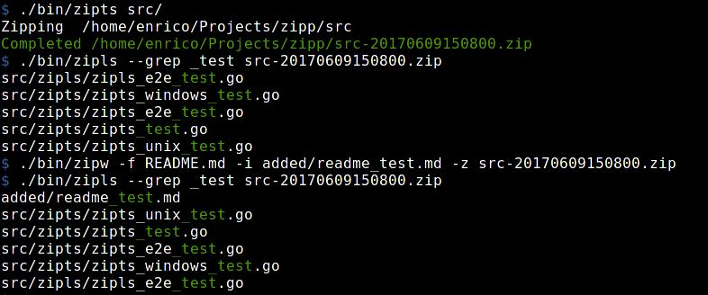

# zipp

Zip utilities:

- `zipls`: lists zip contents
- `zipts`: creates a zip file with a timestamp suffix in the name
- `zipw`: add file to existing zip

## License

Apache 2.0 - see LICENSE file.

Copyright 2014-TODAY zipp contributors
